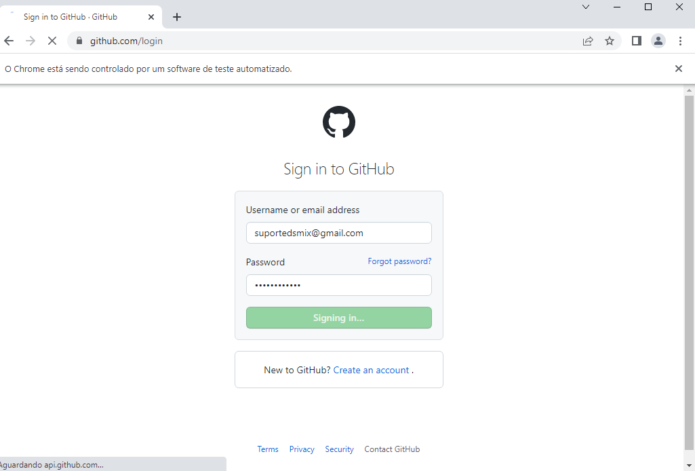
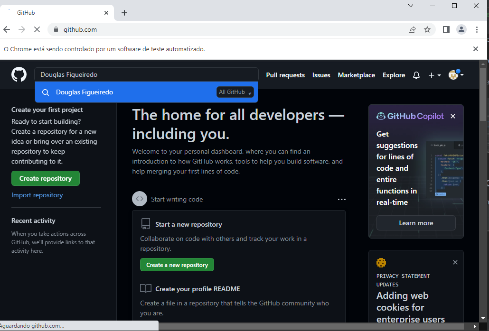
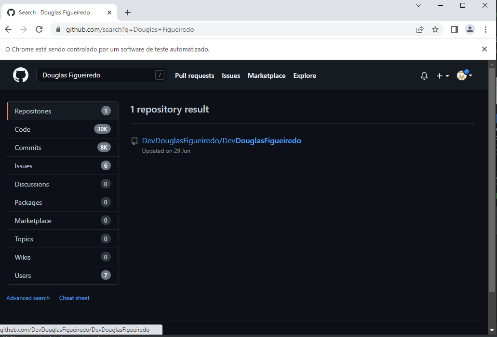
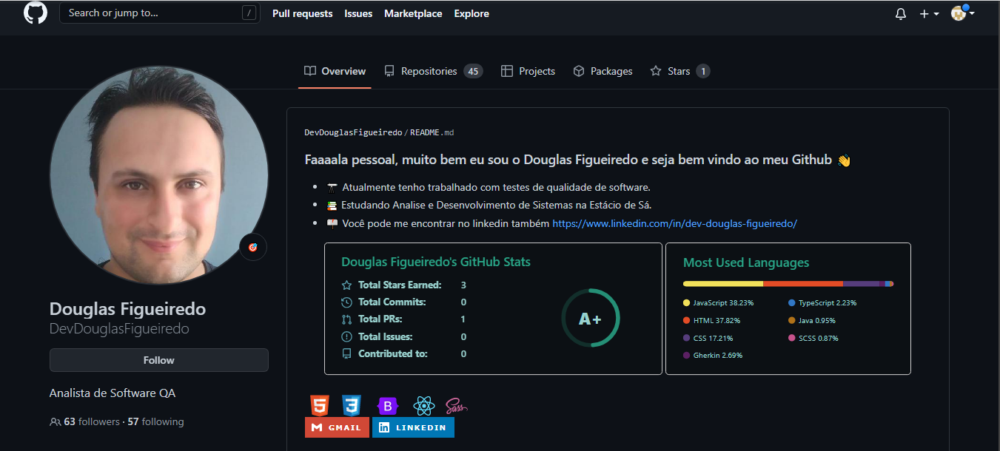
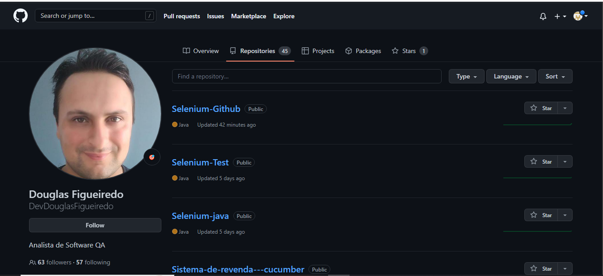
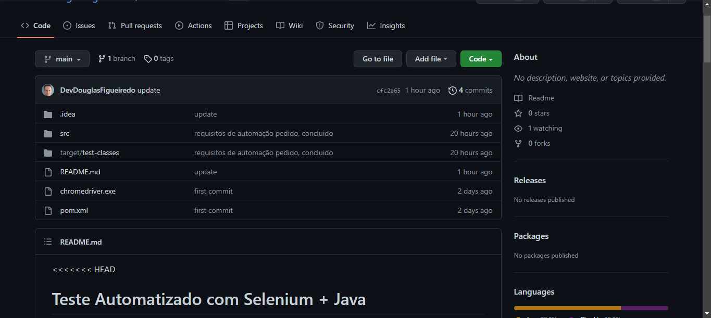
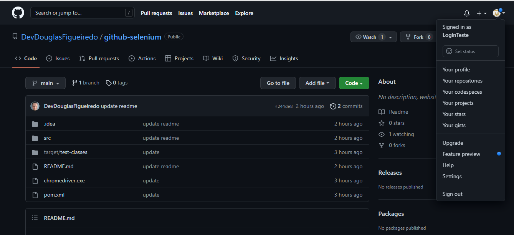
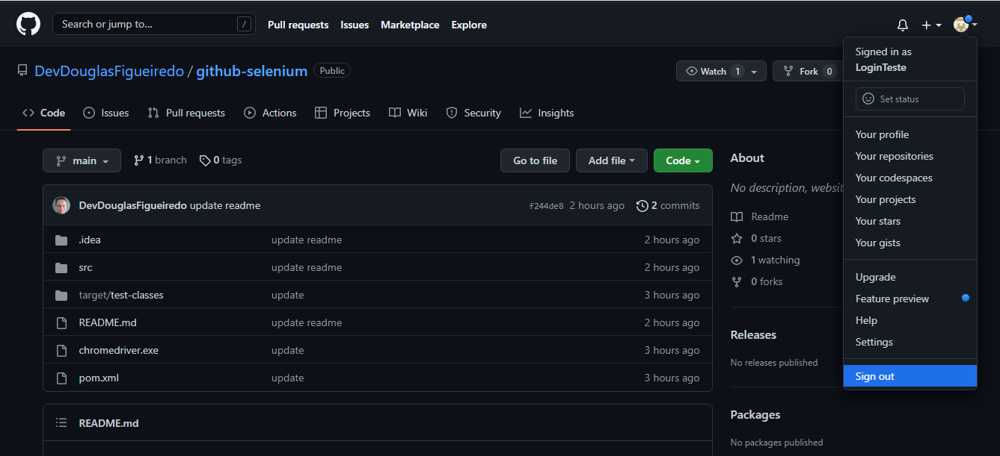

# Teste Automatizado com Selenium + Java

Verificando as credenciais de um novo usúario na plataforma do Github, começando na tela de login, validando
email e senha, e navegando ate um repositório escolhido

## 🚀 Começando

Essas instruções permitirão que você obtenha uma cópia do projeto em operação na sua máquina local para fins de desenvolvimento e teste.


### 📋 Pré-requisitos

De que coisas você precisa para instalar o software e como instalá-lo?

```
Java
1.8 Oracle Open JDK version 1.8.0_202
corretto-1.8 Amazon Corretto version 1.8.0_342
Selenium
ChromeDriver
IDE de sua preferencia ( como sugestão eu indico a IntelliJ)
```

### 🔧 Instalação

Após ter baixado os pré-requistos, instale todos os arquivos!<br>
<br>
Coloque o arquivo **ChromeDriver.exe** na pasta raiz do projeto <br>
<br>
Configure sua estrutura de projeto para que o **corretto-1.8** esteja ativo no SDK


## ⚙️ Executando os testes

A automação dos testes, inicia na tela de login do github com e-mail e senha previamente colocados
no código no arquivo: <br>
Email | LoginStep.java na linha 23 <br>
Senha | LoginStep.java na linha 28 <br>




Após login validado, a automação percorrerá no campo de busca, realizando uma pesquisa previamente
colocada no código também no arquivo: <br>
LoginStep.java na linha 48




E Clicando no link do resultado da busca, indo para o perfil selecionado.





E Acessando os repósitorios do perfil



E acessando o repósitorio selecionado



E efetuando o sign out






## 🛠️ Construído com

* [Selenium](https://www.selenium.dev/) - O framework web usado
* [Maven](https://maven.apache.org/) - Gerente de Dependência
* [Java](https://www.oracle.com/java/technologies/downloads/#jdk18-windows) Linguagem de Programação


