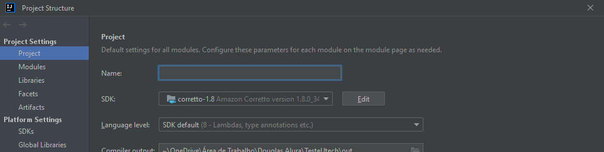

# Teste Automatizado com Selenium + Java

Verificando as credenciais de um novo usúario na plataforma do Github, começando na tela de login, validando
email e senha, e navegando ate um repositório escolhido

## 🚀 Começando

Essas instruções permitirão que você obtenha uma cópia do projeto em operação na sua máquina local para fins de desenvolvimento e teste.


### 📋 Pré-requisitos

De que coisas você precisa para instalar o software e como instalá-lo?

```
Java
1.8 Oracle Open JDK version 1.8.0_202
corretto-1.8 Amazon Corretto version 1.8.0_342
Selenium
ChromeDriver
FireFox
IDE de sua preferencia ( como sugestão eu indico a IntelliJ)
```

### 🔧 Instalação

Após ter baixado os pré-requistos, instale todos os arquivos!<br>
<br>
Coloque o arquivo **ChromeDriver.exe** e/ou **FireFoxDriver.exe** na pasta raiz do projeto <br>
<br>
Configure sua estrutura de projeto para que o **corretto-1.8** esteja ativo no SDK


## ⚙️ Executando os testes

Quatro Cenários:
* Validação de Login
* Realizando uma Busca
* Acessando o dado Busca
* Efetuando o logout

**Para que os testes sejam executados da forma correta deve-se colocar credenciais válidas de email e senha
previamente registrado no Github**

No arquivo **LoginSteps** na **linha 24**, deve-se colocar o e-mail válido
e na **linha 29** a senha válida


## 🛠️ Construído com

* [Selenium](https://www.selenium.dev/) - O framework web usado
* [Maven](https://maven.apache.org/) - Gerente de Dependência
* [Java](https://www.oracle.com/java/technologies/downloads/#jdk18-windows) Linguagem de Programação


